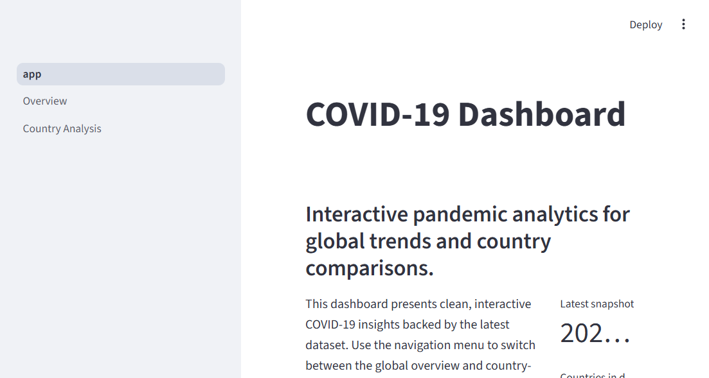
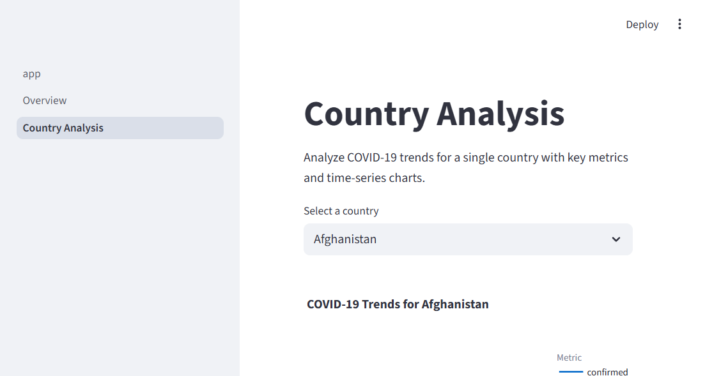

# COVID-19 Streamlit Dashboard

A portfolio analytics dashboard built with Python, Pandas, Streamlit, and Plotly to explore COVID‑19 trends, compare countries, and visualize key metrics.

## Demo

This project is currently intended to run locally.

Run the app with:

```bash
streamlit run app.py
```

If you deploy it later on Streamlit Community Cloud, replace this section with your public app link.

## Screenshots





## Dataset

Source: [Kaggle COVID-19 Dataset](https://www.kaggle.com/datasets/imdevskp/corona-virus-report)

## Tech Stack

- Python
- Pandas
- Streamlit
- Plotly

## Data Processing

- Renamed inconsistent columns
- Parsed dates
- Filled and handled missing values
- Standardized country-level schema

## Insights

- Global trends in confirmed cases, deaths, and recoveries
- Top affected countries by cumulative cases
- Country-level comparison of confirmed, deaths, and recovered trends

## Future Improvements

- Add vaccination analysis
- Add mortality and recovery rate KPIs
- Add download/export options

## Key Features

- Global overview with confirmed cases, deaths, recovered totals, and country count
- Time series visualization for confirmed cases and top-10 affected countries
- Country-level trend analysis for confirmed, deaths, and recovered series
- Robust CSV preprocessing that handles inconsistent source column names
- Streamlit multi-page layout for easy navigation

## Repository Structure

```text
covid-19-analysis-using-Kaggle-data/
├── app.py
├── requirements.txt
├── README.md
├── LICENSE
├── CONTRIBUTING.md
├── .gitignore
├── data/
│   └── covid_2025.csv
├── src/
│   ├── data.py
│   └── charts.py
├── pages/
│   ├── 1_Overview.py
│   └── 2_Country_Analysis.py
└── screenshots/
    ├── overview.png
    └── country-analysis.png
```

## Installation

1. Create and activate a Python virtual environment

```bash
python -m venv .venv
```

Windows:

```bash
.venv\Scripts\activate
```

2. Install dependencies

```bash
pip install -r requirements.txt
```

3. Run the dashboard

```bash
streamlit run app.py
```

## Data Schema

The dashboard expects a dataset with the following normalized fields:

- `country` — country name
- `date` — observation date
- `confirmed` — cumulative confirmed cases
- `deaths` — cumulative deaths
- `recovered` — cumulative recoveries
- `active` — active case count
- `tests` — total tests performed

The loader also supports source columns such as `total_cases`, `total_deaths`, `recovered_cases`, `active_cases`, and `total_tests`.

## Contribution Guidelines

See [CONTRIBUTING.md](CONTRIBUTING.md) for repository standards, branching guidance, and code review expectations.

## License

This project is licensed under the MIT License. See `LICENSE` for details.
